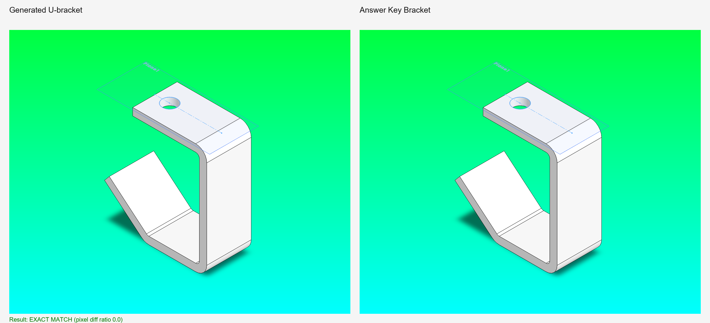

# U-Joint Rebuild Prompts

**Note:** These prompts are for when you have access to the reference SolidWorks sample models and want to match them exactly. For learning and from-scratch builds, start with the [U-Joint Assembly Tutorial](../tutorials/u-joint-assembly-build.md) instead.

Reference models location:

```
C:\Users\Public\Documents\SOLIDWORKS\SOLIDWORKS 2026\samples\learn\U-Joint\
```

## Reference Model Analysis

Before using these prompts, inspect the reference assembly to understand the geometry:

- `bracket.sldprt` — Mounting base
- `Yoke_male.sldprt` — Primary yoke arm
- `Yoke_female.sldprt` — Secondary yoke arm  
- `Spider.sldprt` — Cross hub connecting yokes
- `Pin.sldprt` — Shaft pin (qty 4 in assembly)
- `Crank_shaft.sldprt` — Drive shaft
- `Crank_arm.sldprt` — Actuation lever
- `Crank_knob.sldprt` — Grip handle
- `UJoint.SLDASM` — Complete assembly

## Prompt 1: Bracket (Exact Parity)

Use this prompt if you want to match the reference bracket exactly and keep the same feature-tree shape.

```
Create Bracket_v1.SLDPRT from scratch to match the reference model exactly.

Use mm units and do not add extra features.

Required feature tree:
1. Sketch1
2. Base-Extrude-Thin
3. Sketch2
4. Cut-Extrude1

Build steps (exact dimensions):
1. On Front Plane, create Sketch1 using these connected line segments:
   - (0.00, 0.00) to (0.00, 82.55)
   - (0.00, 82.55) to (-57.15, 82.55)
   - (-57.15, 82.55) to (-77.216, 27.494)
   - (-77.216, 27.494) to (-44.45, 0.00)
   
   Add dimensions to ALL lines, ensure all sketches are fully defined before moving on. 
   Ensure the first and last points are NOT connected, it's an open u-bracket design.

2. Create Base-Extrude-Thin:
   - Mid-plane depth: 38.10
   - Thin wall thickness: 6.35
   - Auto-fillet corners ON
   - Corner radius: 3.175

3. Create Sketch2 on the top planar face (offset plane from Top Plane at 88.90 if needed).

4. In Sketch2:
   - Add centerline from (0.00, 0.00) to (-57.15, 0.00)
   - Add circle centered at (-44.45, 0.00) with diameter 12.70

5. Create Cut-Extrude1:
   - Blind cut depth: 10.00

Validation requirements:
- Report final feature tree names in order.
- Export isometric PNG as bracket_isometric.png.
- Compare against reference bracket isometric and report mismatch status.

Save the part as Bracket_v1.SLDPRT.
```

Verification snapshot from this run:



## Prompt 2: All Yoke Parts (Exact Parity)

```
Create Yoke_male.SLDPRT and Yoke_female.SLDPRT from scratch to match the reference models exactly.

Reference models:
- C:\Users\Public\Documents\SOLIDWORKS\SOLIDWORKS 2026\samples\learn\U-Joint\Yoke_male.sldprt
- C:\Users\Public\Documents\SOLIDWORKS\SOLIDWORKS 2026\samples\learn\U-Joint\Yoke_female.sldprt

Steps:
1. Inspect the reference yoke parts and extract geometry, dimensions, and feature sequence
2. Build Yoke_male.SLDPRT with exact feature tree and dimensions
3. Build Yoke_female.SLDPRT (may be identical or slightly different)
4. Replicate appearance and material properties
5. Validate: Report feature tree for each yoke and confirm they match reference models

Export isometric PNG for each: Yoke_male_isometric.png and Yoke_female_isometric.png
```

## Prompt 3: Spider and Pin

```
Create Spider.SLDPRT and Pin.SLDPRT from scratch to match the reference models exactly.

Reference models:
- C:\Users\Public\Documents\SOLIDWORKS\SOLIDWORKS 2026\samples\learn\U-Joint\Spider.sldprt
- C:\Users\Public\Documents\SOLIDWORKS\SOLIDWORKS 2026\samples\learn\U-Joint\Pin.sldprt

Steps:
1. Inspect reference parts and extract exact dimensions and feature sequences
2. Build Spider.SLDPRT: cross-shaped hub with four radial bores for pins
3. Build Pin.SLDPRT: cylindrical shaft with head flange
4. Match all critical dimensions and tolerances
5. Validate: Report feature tree for each part

Export isometric PNG for each: Spider_isometric.png and Pin_isometric.png
```

## Prompt 4: Crank Parts (Shaft, Arm, Knob)

```
Create Crank_shaft.SLDPRT, Crank_arm.SLDPRT, and Crank_knob.SLDPRT from scratch to match reference models exactly.

Reference models:
- C:\Users\Public\Documents\SOLIDWORKS\SOLIDWORKS 2026\samples\learn\U-Joint\Crank_shaft.sldprt
- C:\Users\Public\Documents\SOLIDWORKS\SOLIDWORKS 2026\samples\learn\U-Joint\Crank_arm.sldprt
- C:\Users\Public\Documents\SOLIDWORKS\SOLIDWORKS 2026\samples\learn\U-Joint\Crank_knob.sldprt

Steps:
1. Inspect all three crank parts and extract geometry
2. Build Crank_shaft.SLDPRT with drive flange and mounting holes
3. Build Crank_arm.SLDPRT with connection bore and grip section
4. Build Crank_knob.SLDPRT with sphere body and connection post
5. Match all critical dimensions
6. Validate: Report feature tree for each part

Export isometric PNG: Crank_shaft_isometric.png, Crank_arm_isometric.png, Crank_knob_isometric.png
```

## Prompt 5: Assembly Build (Exact Parity)

```
Create UJoint.SLDASM from scratch to match the reference assembly exactly.

Reference assembly: C:\Users\Public\Documents\SOLIDWORKS\SOLIDWORKS 2026\samples\learn\U-Joint\UJoint.SLDASM

Steps:
1. Inspect reference assembly: component tree, mate list, DOF constraints
2. Insert all 8 parts (or required qty) with exact mate sequence
3. Replicate every mate (coincident, concentric, distance, angle, etc.)
4. Validate final assembly:
   - All parts present in correct locations
   - All mates fully defined (no under-constraint)
   - No over-constraint
   - No interference between parts
   - Mechanism articulates smoothly (if applicable)
5. Report:
   - Total mate count and types
   - Interference analysis
   - Motion summary (free DOF, constrained DOF)

Export isometric PNG of final assembly.
```

## Prompt 6: Final QA and Parity Check

```
Perform final parity check between your generated parts/assembly and the reference UJoint.SLDASM.

Checklist:
- [ ] All 8 parts exist and are correctly named
- [ ] Each part feature tree matches reference model
- [ ] Assembly has all required mates
- [ ] Assembly is fully defined
- [ ] No interference detected
- [ ] Crank shaft and driven components articulate correctly
- [ ] All dimensions within ±0.5% of reference models
- [ ] Material properties match (if specified)
- [ ] Appearance/color matches reference (if specified)

For any mismatches:
- Identify which part or mate differs
- Report the specific deviation
- Provide corrective action (re-build part, adjust mate, etc.)
- Re-validate after correction

Generate final pass/fail report with images (isometric view from 3 angles).
```

---

## When to Use These Prompts

**Use these prompts if:**

- You want to match the exact SolidWorks reference sample
- You're validating MCP tool accuracy against known geometry
- You need a precise baseline for comparative testing

**Use the [U-Joint Assembly Tutorial](../tutorials/u-joint-assembly-build.md) if:**

- You're learning MCP and the Prefab UI workflow
- You want to build from scratch without reference constraints
- You want to modify dimensions for your application
- You're designing a custom U-joint variant

---

## Related

- [U-Joint Assembly Tutorial (From Scratch)](../tutorials/u-joint-assembly-build.md)
- [SolidWorks as Code](../solidworks-as-code.md)
- [Tool Catalog](../../user-guide/tool-catalog/index.md)
