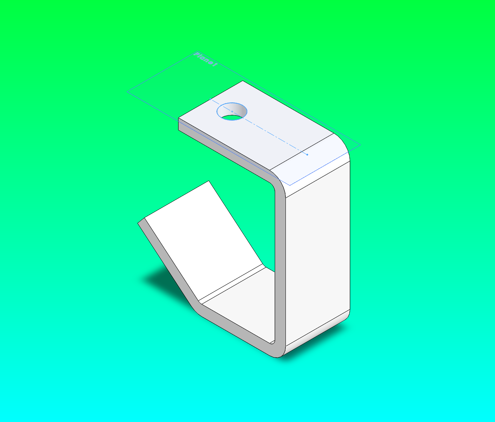
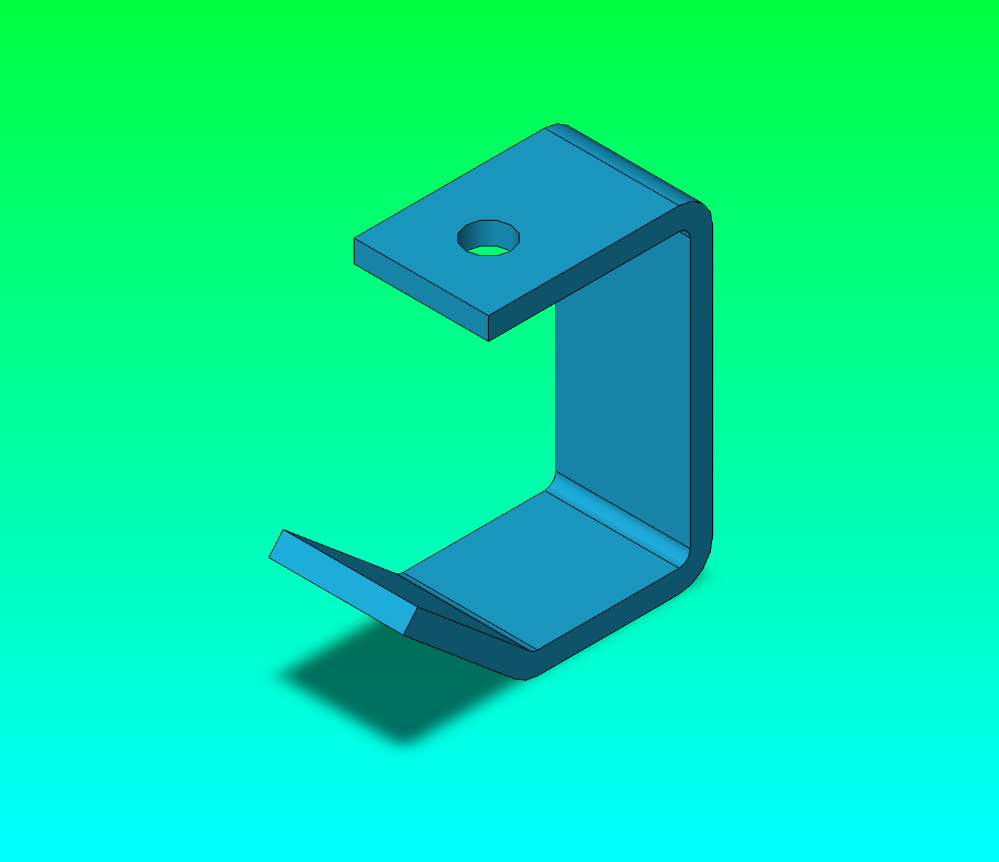
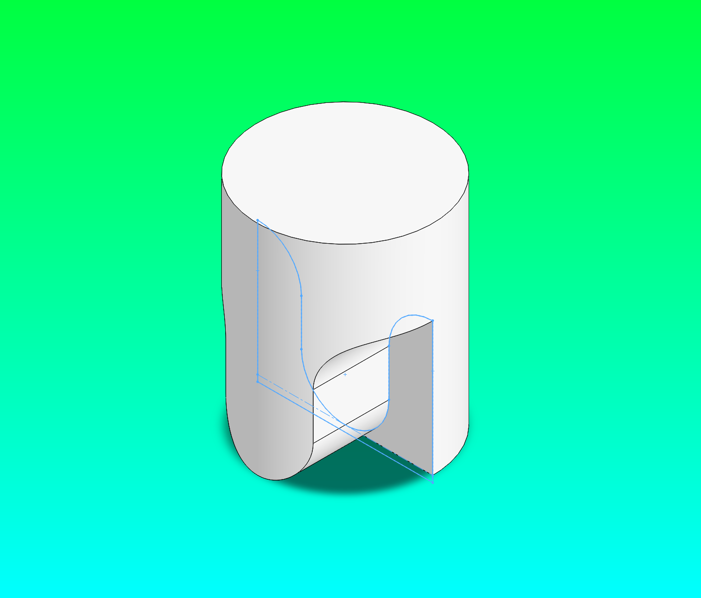
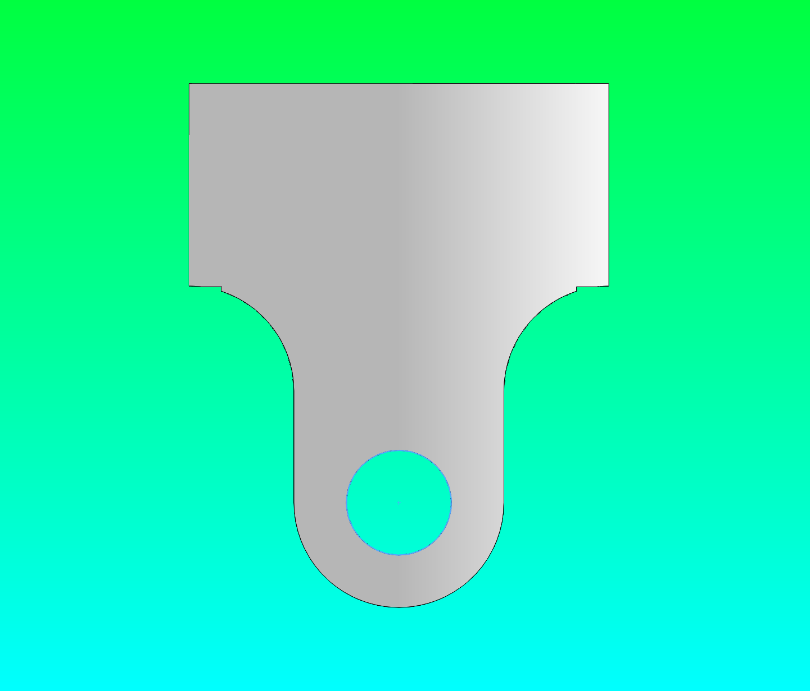
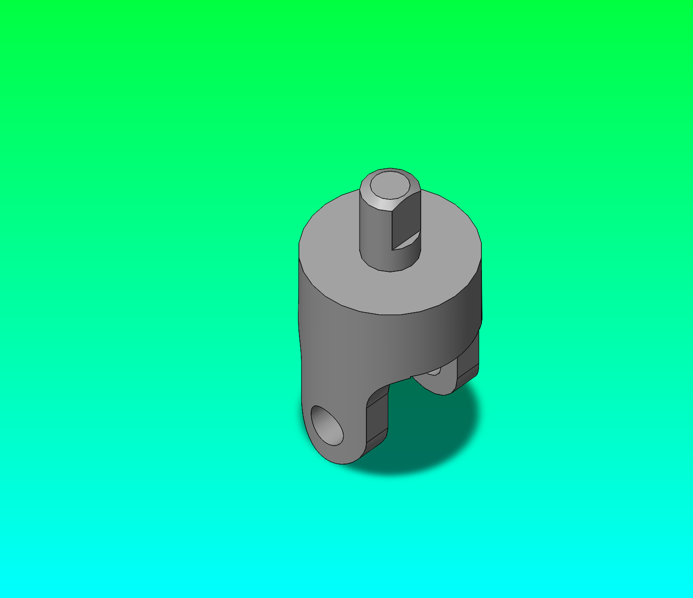

# Getting Started: Building SolidWorks Parts with Python

This tutorial takes you from zero to three completed SolidWorks parts — no prior Python or CAD automation experience required. By the end you will understand how the MCP adapter talks to SolidWorks, how to run and read build scripts, how to interpret errors, and how the checkpoint-and-restore workflow lets you recover from mistakes without undoing 20 mouse clicks.

**What you'll build** (from the SolidWorks 2026 U-Joint sample assembly):

| Part | Script | What you learn |
|---|---|---|
| U-bracket | `build_u_bracket_artifact.py` | Run a script, verify output |
| Yoke Male (tutorial) | `build_yoke_male_tutorial.py` | Checkpoint, intentional mistake, restore |
| Yoke Female | `build_yoke_female_artifact.py` | Full build, answer-key comparison |

---

## How it works

Before touching any code, build this mental model:

```
Your Python script
      |
      v
solidworks_mcp adapter      (translates Python calls into COM operations)
      |
      v
Windows COM / pywin32       (talks to the running SolidWorks.exe process)
      |
      v
SolidWorks                  (opens files, creates sketches, extrudes, saves)
```

When your script calls `await adapter.create_sketch("Front")`, the adapter tells SolidWorks to open a new sketch on the Front plane — exactly as if you had clicked **Insert > Sketch** in the UI. The rest of the script sequences those calls so they execute in order.

**Why `await` everywhere?** Every adapter method is an async coroutine. If you forget `await`, Python silently does nothing — no error, no SolidWorks action. Always `await` every adapter call.

---

## Prerequisites

- SolidWorks is installed and you have opened it at least once (so COM registration is complete).
- You have cloned the repo and run the install:

```powershell
git clone https://github.com/andrewbartels1/SolidworksMCP-python.git
cd SolidworksMCP-python
python -m venv .venv
.\.venv\Scripts\python.exe -m pip install --upgrade pip setuptools wheel
.\.venv\Scripts\python.exe -m pip install -e .
```

- A PowerShell window open inside the `SolidworksMCP-python` folder.

---

## Step 0 — Verify the connection

**Open SolidWorks first.** Then run:

```powershell
.\.venv\Scripts\python.exe -c "
import asyncio
from solidworks_mcp.config import load_config
from solidworks_mcp.adapters import create_adapter

async def check():
    config = load_config()
    adapter = await create_adapter(config)
    await adapter.connect()
    result = await adapter.get_model_info()
    print('Connected OK')
    print('Active model:', result.data if result.is_success else 'none (no file open)')
    await adapter.disconnect()

asyncio.run(check())
"
```

**Good output:**

```
2026-05-22 18:44:12 | INFO | SolidWorks type info loaded: 418 interfaces, ...
Connected OK
Active model: none (no file open)
```

The INFO line is normal startup noise — the adapter is loading the SolidWorks type library. `Active model: none` is fine; it just means SolidWorks is open but no `.sldprt` is active yet.

**If you see this instead:**

```
pywintypes.com_error: (-2147221005, 'Invalid class string', None, None)
```

SolidWorks is not running. Open it and try again. If SolidWorks was open but you restarted it after starting the server, you may need to restart the Python process too (stale COM handle — see [Troubleshooting](#troubleshooting-checklist) below).

---

## Part 1 — The U-bracket

### Run the script

```powershell
.\.venv\Scripts\python.exe docs\getting-started\tutorial-parts\build_u_bracket_artifact.py
```

**While this runs**, switch to SolidWorks. You will watch the part build live:

1. A new part file opens.
2. A profile sketch appears on the Front plane — four connected line segments forming an open U-shape.
3. The profile extrudes as a thin-walled shell (the U-bracket body).
4. A sketch appears on the top flange.
5. A circle is cut through to form the mounting hole.
6. The file saves and a PNG exports.

**Successful terminal output:**

```
2026-05-22 18:45:01 | INFO | SolidWorks type info loaded: 418 interfaces, ...
C:\...\docs\getting-started\tutorial-parts\u_bracket_from_prompt.SLDPRT
C:\...\docs\getting-started\tutorial-parts\u_bracket_from_prompt_isometric.png
C:\...\docs\getting-started\tutorial-parts\answer_key_bracket_isometric.png
```

The three file paths confirm: part saved, isometric image exported, answer key image exported.

### View and compare the output

Open `docs/getting-started/tutorial-parts/u_bracket_from_prompt_isometric.png` — the generated result:



Then compare against `answer_key_bracket_isometric.png` (exported from the SolidWorks 2026 sample):



The shapes match: same C-profile with the angled lower lip and mounting hole on the top flange. The color difference (white vs teal) is a SolidWorks appearance property on the sample — it does not affect geometry.

Side-by-side comparison showing **EXACT MATCH**:


---

## Anatomy of a build script

Open `docs/getting-started/tutorial-parts/build_u_bracket_artifact.py`. Every build script follows this pattern:

```python
async def build_part() -> None:
    config = load_config()
    adapter = await create_adapter(config)
    await adapter.connect()
    try:
        # 1. Create a new part file in SolidWorks
        require(await adapter.create_part(name="u_bracket_from_prompt"), "create_part")

        # 2. Open a sketch on a named plane
        require(await adapter.create_sketch("Front"), "create_sketch profile")

        # 3. Draw geometry — lines, arcs, circles
        require(await adapter.add_line(0, 0, 0, 82.55), "line 1")
        require(await adapter.add_line(0, 82.55, -57.15, 82.55), "line 2")
        # ...

        # 4. Exit the sketch — SolidWorks requires this before creating a feature
        require(await adapter.exit_sketch(), "exit_sketch")

        # 5. Create a feature from the closed sketch profile
        require(
            await adapter.create_extrusion(
                ExtrusionParameters(depth=38.10, thin_feature=True, thin_thickness=6.35)
            ),
            "base extrude",
        )

        # 6. Repeat for additional sketches and features ...

        # 7. Save and export evidence
        require(await adapter.save_file(str(OUTPUT_PART)), "save_file")
        require(await adapter.export_image({"file_path": str(OUTPUT_IMAGE), ...}), "export")

    finally:
        await adapter.disconnect()  # always runs, even after an error
```

The `require()` helper stops the script the moment any step fails:

```python
def require(result: Any, label: str) -> Any:
    if not result.is_success:
        raise RuntimeError(f"{label} failed: {result.error}")
    return result
```

Without this, a failed extrusion would let the script continue, applying the next sketch to a broken solid — and you would get a confusing error five steps later with no indication where things went wrong.

---

## Reading errors

Errors fall into a small set of recognizable patterns.

### Profile rejected — cut returns None

```
RuntimeError: USlot cut through-all-both failed: Error in create_cut_extrude:
Failed to create cut extrude feature.
FeatureCut4: None | FeatureCut3 modern: None | FeatureCut3 legacy:
(-2147352561, 'Parameter not optional.')
```

**What it means:** SolidWorks received the cut command but rejected the sketch profile. Three `FeatureCut` API variants are tried in order; all returned `None` or threw a COM error.

**Most common causes:**

- The profile has an open endpoint — two segments don't share a vertex.
- An arc passes through a point that also lies on a line in the same sketch (self-intersection).
- The sketch was not properly exited before the cut call.

**What to do:** Open the part in SolidWorks, right-click the failed sketch in the feature tree, choose **Edit Sketch**, and look for dangling (red) endpoints or an open-contour warning in the status bar.

### No active model

```
RuntimeError: create_sketch BaseCircle failed: No active model
```

**What it means:** `create_part()` failed or was skipped, so there is no open document to sketch into.

**What to do:** Scroll up — there will be a `create_part` failure earlier in the output. Usually the cause is a SolidWorks dialog box (template chooser, license warning) blocking automation. Click through it once manually, then re-run.

### SolidWorks not running

```
pywintypes.com_error: (-2147221005, 'Invalid class string', None, None)
```

**Fix:** Open SolidWorks, then re-run the script.

### Circuit breaker open

```
RuntimeError: create_sketch failed: Circuit breaker is open for create_sketch
```

**What it means:** Multiple consecutive failures triggered a safety valve. The adapter stops accepting calls for that operation for ~60 seconds.

**Fix:** Wait 60 seconds and re-run. The breaker resets automatically.

### Stale COM handle

If you restart SolidWorks while a Python process is running (or was recently running), the Python process holds a dead COM pointer. Calls fail or throw COM errors.

**Fix:** Kill the Python process (`Ctrl+C`), re-open SolidWorks, re-run the script.

---

## Part 2 — Checkpoint and restore: fixing a mistake

This is the most important workflow to practice. In a real design session you will make mistakes. Checkpoint-and-restore lets you recover without losing all prior work.

### Run the tutorial script

```powershell
.\.venv\Scripts\python.exe docs\getting-started\tutorial-parts\build_yoke_male_tutorial.py
```

The script prints a banner before each act:

```
--------------------------------------
Act 1: Build base features to checkpoint
--------------------------------------
  [1] Base cylinder - dia38.10mm x 47.625mm
  [2] U-slot cut - Front plane, through-all-both
  [3] Arm gap cut - Right plane, through-all-both
  [4] Pin bore - Front plane, through-all-both
  [5] Saving checkpoint to yoke_male_checkpoint_preStub.SLDPRT

-------------------------------------------
Act 2: Apply WRONG stub shaft (19.050mm from Top)
-------------------------------------------
  [6] WRONG: stub shaft 19.050mm from Top - buried inside base cylinder!
  [7] Saving wrong version to yoke_male_wrong_stub.SLDPRT

-----------------------------------------------
Act 3: Restore from checkpoint, apply correct stub
-----------------------------------------------
  [8] Restoring from checkpoint: yoke_male_checkpoint_preStub.SLDPRT
  [9] CORRECT: stub shaft 66.675mm from Top (net 19.050mm above base)
 [10] D-bore (keyway) cut on stub shaft top face
 [11] Saving final to yoke_male_v2_from_prompt.SLDPRT
```

### Act 1 — Build to checkpoint

The first four steps build the yoke body. Watch SolidWorks as each feature appears:

1. **Base cylinder** — a dia 38.10mm circle on the Top plane extrudes 47.625mm upward.
2. **U-slot cut** — a U-shaped profile on the Front plane cuts through both sides in Z, leaving the two arm sections.
3. **Arm gap cut** — a rectangle on the Right plane cuts through in X, opening the gap between the front and back arms.
4. **Pin bore** — a circle on the Front plane cuts through both arms in Z at Y = 9.525mm (the pin hole).

At step 5 the script calls `adapter.save_file(CHECKPOINT_PART)`, creating `yoke_male_checkpoint_preStub.SLDPRT`. This is the restore point.

**What you see in SolidWorks after the checkpoint save** — the base features complete, with the pin bore sketch still visible as the last active sketch:



### Act 2 — The intentional mistake

Act 2 extrudes a stub shaft of only 19.050mm from the Top plane. The base cylinder is already 47.625mm tall, so the stub is completely buried — it never protrudes. The script saves `yoke_male_wrong_stub.SLDPRT`. If you open it in SolidWorks you will see: no stub shaft anywhere on the part.

### Act 3 — Restore and fix

Act 3 runs one line to undo everything since the checkpoint:

```python
await adapter.open_model(str(CHECKPOINT_PART))
```

SolidWorks opens `yoke_male_checkpoint_preStub.SLDPRT` — exactly as it was after Act 1. The wrong Act 2 extrusion never happened in this document.

The correct stub shaft uses a depth of **66.675mm** from the Top plane. Here is the geometry reasoning:

```
Base cylinder height:  47.625mm
Total extrusion depth: 66.675mm
                       --------
Net protrusion:        19.050mm  (the visible stub shaft)
```

The 6.35mm-radius stub circle is smaller than the base cylinder radius (19.050mm). For the first 47.625mm the stub merges invisibly into the base solid. Only the top 19.050mm protrudes as the shaft. This avoids selecting the top face of the base cylinder by coordinate — which is unreliable after parametric cuts have changed the part topology.

**Final output after Act 3:**



### The checkpoint pattern in your own scripts

```python
CHECKPOINT = Path("my_part_checkpoint.SLDPRT")

# Build solid features
require(await adapter.create_extrusion(...), "base extrude")

# Save a checkpoint before the risky step
require(await adapter.save_file(str(CHECKPOINT)), "checkpoint save")

# Attempt the risky step
result = await adapter.create_cut_extrude(...)

if not result.is_success:
    # Restore and try differently
    require(await adapter.open_model(str(CHECKPOINT)), "restore")
    # ... corrected approach ...
```

**When to create a checkpoint:**

| Trigger | Why |
|---|---|
| Main body mass looks correct | Cuts can create topology that makes faces impossible to select by coordinate |
| Before any face-selection step | The most fragile operation in programmatic CAD |
| Before a risky or experimental feature | Costs one save; saves all prior work |

---

## Part 3 — Build the complete Yoke Male

The artifact script builds the Yoke Male in one uninterrupted run:

```powershell
.\.venv\Scripts\python.exe docs\getting-started\tutorial-parts\build_yoke_male_artifact.py
```

**Terminal output:**

```
2026-05-22 18:48:33 | INFO | SolidWorks type info loaded: 418 interfaces, ...
C:\...\docs\getting-started\tutorial-parts\yoke_male_from_prompt.SLDPRT
C:\...\docs\getting-started\tutorial-parts\yoke_male_from_prompt_isometric.png
C:\...\docs\getting-started\tutorial-parts\answer_key_yoke_male_isometric.png
```

The script builds six features in sequence:

| Step | Feature | SolidWorks operation |
|---|---|---|
| 1 | Base cylinder dia 38.10mm × 47.625mm | Sketch circle on Top → Extrude |
| 2 | U-slot cut | Sketch arcs + lines on Front → Cut through-all-both |
| 3 | Arm gap cut | Sketch rectangle on Right → Cut through-all-both |
| 4 | Pin bore | Sketch circle on Front → Cut through-all-both |
| 5 | Stub shaft | Sketch circle on Top → Extrude 66.675mm |
| 6 | D-bore (keyway) | Sketch D-profile on stub top face → Cut through-all |

---

## Part 4 — Build the Yoke Female

```powershell
.\.venv\Scripts\python.exe docs\getting-started\tutorial-parts\build_yoke_female_artifact.py
```

**Terminal output:**

```
2026-05-22 18:50:24 | INFO | SolidWorks type info loaded: 418 interfaces, ...
C:\...\docs\getting-started\tutorial-parts\yoke_female_from_prompt.SLDPRT
C:\...\docs\getting-started\tutorial-parts\yoke_female_from_prompt_isometric.png
C:\...\docs\getting-started\tutorial-parts\answer_key_yoke_female_isometric.png
```

**Verify the result** — generated (left) vs answer key (right):

| Generated | Answer key |
|---|---|
|  |  |

The shapes are identical: cylindrical base, U-fork arms, pin bore through both arms, and bolt holes on the top face.

### Key differences from the Yoke Male

The female yoke shares most geometry with the male but differs in two places:

| Feature | Yoke Male | Yoke Female |
|---|---|---|
| U-slot outer wall bottom | Y = -1.366mm | Y = -0.5mm |
| Arm gap starting Y | -7.455mm | 0mm |
| Top feature | Stub shaft + D-bore | 4x bolt holes (dia 6.35mm) |

**Why the bottom edge is not at Y = 0.0** — the U-bottom arc has its centre at Y = 9.525mm and radius 9.525mm, so it reaches exactly Y = 0 at its lowest point. If the closing line were also at Y = 0, the arc and line would share the interior point (0, 0) — a self-intersecting sketch that SolidWorks silently rejects. Placing the line at Y = -0.5 keeps it below where the arc reaches; the final cut geometry is identical because anything below Y = 0 is outside the solid anyway.

This self-intersection is caught automatically in the interactive SolidWorks UI (the sketch solver splits the line at the tangent point). Through the COM API you must handle it yourself by keeping the closing line slightly below the arc's minimum.

---

## Sketch coordinate system reference

| Sketch plane | Sketch X axis | Sketch Y axis | Extrude/cut direction |
|---|---|---|---|
| Top | World X | World Z | World +Y (upward) |
| Front | World X | World Y | World ±Z |
| Right | World Z | World Y | World ±X |

All dimensions in scripts are millimeters. The adapter converts to metres for the SolidWorks COM API.

---

## Writing your own build script

Start from this minimal template:

```python
from __future__ import annotations

import asyncio
from pathlib import Path
from typing import Any

from solidworks_mcp.adapters import create_adapter
from solidworks_mcp.adapters.base import ExtrusionParameters
from solidworks_mcp.config import load_config

OUTPUT = Path("my_cylinder.SLDPRT")


def require(result: Any, label: str) -> Any:
    if not result.is_success:
        raise RuntimeError(f"{label} failed: {result.error}")
    return result


async def build() -> None:
    config = load_config()
    adapter = await create_adapter(config)
    await adapter.connect()
    try:
        require(await adapter.create_part(name="my_cylinder"), "create_part")

        # Sketch a circle on the Top plane
        # Top plane coords: sketch_x = world X, sketch_y = world Z
        require(await adapter.create_sketch("Top"), "sketch")
        require(await adapter.add_circle(0, 0, 25.0), "circle r=25mm")
        require(await adapter.exit_sketch(), "exit sketch")

        # Extrude 50mm upward (+Y)
        require(
            await adapter.create_extrusion(ExtrusionParameters(depth=50.0)),
            "extrude 50mm",
        )

        require(await adapter.save_file(str(OUTPUT)), "save")
        print(OUTPUT)
    finally:
        await adapter.disconnect()


if __name__ == "__main__":
    asyncio.run(build())
```

Save it anywhere inside the repo and run it:

```powershell
.\.venv\Scripts\python.exe my_cylinder.py
```

A 50mm-tall, 50mm-diameter cylinder will appear in SolidWorks.

### Adding a cut

```python
# After the extrude, bore a 10mm-radius hole through the top
require(await adapter.create_sketch("Top"), "bore sketch")
require(await adapter.add_circle(0, 0, 10.0), "bore circle r=10mm")
require(await adapter.exit_sketch(), "exit bore sketch")
require(
    await adapter.create_cut_extrude(
        ExtrusionParameters(depth=0.0, end_condition="ThroughAll")
    ),
    "bore cut",
)
```

Use `both_directions=True` to cut through both sides from the sketch plane.

### Saving a checkpoint mid-script

```python
CHECKPOINT = Path("my_cylinder_cp.SLDPRT")

# ... build solid body ...

require(await adapter.save_file(str(CHECKPOINT)), "checkpoint")

# ... attempt risky step ...
# If wrong, restore and redo:
require(await adapter.open_model(str(CHECKPOINT)), "restore checkpoint")
```

---

## Troubleshooting checklist

Work through this list in order before filing a bug:

1. **Is SolidWorks open?** — The adapter needs a running process. Open it, then re-run.
2. **Did you restart SolidWorks after starting Python?** — Stale COM handle. Kill Python (`Ctrl+C`) and re-run.
3. **Circuit breaker tripping repeatedly?** — Wait 60 seconds, re-run. If it keeps tripping, look at the underlying error in the line above the circuit breaker message.
4. **Profile not closed?** — Open the part in SolidWorks, right-click the sketch in the feature tree, **Edit Sketch**, look for dangling endpoints or the open-contour status bar warning.
5. **Is the sketch self-intersecting?** — Arcs that reach the boundary of another sketch entity at a non-vertex point are rejected. Move the boundary line slightly outside the arc's reach.
6. **Running in mock mode?** — Without `--real` in your MCP server args, all operations return fake data. Check your `mcp.json` configuration.

---

## What's next

| Resource | What it covers |
|---|---|
| [SolidWorks as Code](../solidworks-as-code.md) | Session logging, checkpoint export, rewind/pickup cycle |
| [Prompting Best Practices](../../user-guide/prompting-best-practices.md) | How to prompt Claude Code to generate build scripts |
| [Tool Catalog: Modeling](../../user-guide/tool-catalog/modeling.md) | Full reference for all modeling tools |
| [Tool Catalog: Sketching](../../user-guide/tool-catalog/sketching.md) | All sketch entity and constraint tools |
| [U-Joint Rebuild Prompts](../tutorial-parts/u_joint_rebuild_prompt.md) | Ready-to-use prompts for Spider, Pin, Crank parts |
